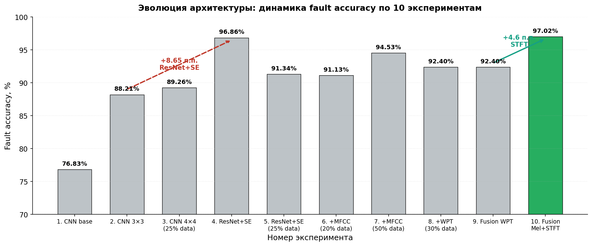

# Drone Fault Diagnosis by Acoustic Signals — FusionResNetSEMTLCNN

> Двухпотоковая нейросетевая модель для **акустической диагностики неисправностей малых беспилотных авиационных систем (БАС)** массой 250 г – 30 кг. По 0,5-секундному фрагменту бортовой аудиозаписи модель классифицирует **9 состояний аппарата** (норма, отказ мотора MF1–MF4, обрез пропеллера PC1–PC4) и **6 направлений манёвра**.
>
> **Результат на тестовой выборке (n = 194 329):** fault accuracy **97,02 %**, F1 (weighted) **0,9701**.

Работа выполнена в рамках выпускной квалификационной работы (ВКР) по специальности «Техносферная безопасность», кафедра Е5 «Техносферная безопасность и вычислительная механика», БГТУ «ВОЕНМЕХ» им. Д.Ф. Устинова, 2026 г.

---

## Содержание

- [Архитектура модели](#архитектура-модели)
- [Установка](#установка)
- [Использование](#использование)
- [Структура репозитория](#структура-репозитория)
- [Датасет](#датасет)
- [Результаты](#результаты)
- [Цитирование](#цитирование)
- [Лицензия](#лицензия)

---

## Архитектура модели

`FusionResNetSEMTLCNN` — двухпотоковая нейросеть с **1 304 447 обучаемыми параметрами** (~5 МБ при float32):

- **Мел-ветвь:** мел-спектрограмма 20 × 64 → Conv1D → 3 × SEResidualBlock → AdaptiveAvgPool → FC(128 → 96);
- **STFT-ветвь:** 32 кастомных STFT-статистики (узкополосные в диапазоне 2–3 кГц + широкополосные) → FC(32 → 32);
- **Fusion:** конкатенация 96 + 32 = 128 → FC(128 → 64);
- **Две головы (MTL):** fault (9 классов) и maneuver (6 классов).


Подробное описание архитектуры и блока SEResidualBlock — в `src/model.py` и `figures/fig_se_residual_block.png`.

---

## Установка

Требования: **Python 3.10+**, желательно — GPU с поддержкой CUDA 12.x для обучения (для инференса достаточно CPU).

```bash
git clone https://github.com/<your-username>/drone-fault-diagnosis-acoustic.git
cd drone-fault-diagnosis-acoustic

python -m venv .venv
# Windows:
.venv\Scripts\activate
# Linux/Mac:
source .venv/bin/activate

pip install -r requirements.txt
```

---

## Использование

### Инференс на одном файле

```bash
python -m src.predict data/samples/A_B_MF1_185_DuckPond_637_snr=13.18.wav
```

Ожидаемый вывод:

```
Fault:    MF1 (confidence 0.97...)
Maneuver: B (confidence 0.94...)

Top-3 fault probabilities:
  MF1: 0.97...
  MF2: 0.02...
  N:   0.01...
```

### Программный API

```python
from src.predict import predict

result = predict("path/to/audio.wav")
print(result["fault_class"])         # 'MF1', 'PC2', 'N' и т. д.
print(result["fault_confidence"])    # 0.0 – 1.0
print(result["fault_probs"])         # вероятности по всем 9 классам
```

### Извлечение признаков

```python
from src.features import extract_all

mel, stft = extract_all("path/to/audio.wav")
print(mel.shape)   # (20, 64) — мел-спектрограмма
print(stft.shape)  # (32,)   — статистические признаки
```

### Обучение

Полный код обучения с обработкой данных, аугментациями и сохранением метрик — в `notebooks/final_model.ipynb`. Базовые функции `train_one_epoch()` и `evaluate()` — в `src/train.py`.

Гиперпараметры:

- Batch size: 128;
- Optimizer: Adam (lr = 1×10⁻³, β₁ = 0,9, β₂ = 0,999);
- Scheduler: ReduceLROnPlateau (patience = 5, factor = 0,5);
- Loss: `0.8 * CE_fault + 0.2 * CE_maneuver`;
- Эпохи: 50, early stopping patience = 10;
- Стратификация выборки: 6:2:2 по составному ключу `модель × класс × манёвр`.

---

## Структура репозитория

```
drone-fault-diagnosis-acoustic/
├── README.md                       — этот файл
├── LICENSE                         — MIT License
├── .gitignore                      — служебные исключения
├── requirements.txt                — Python-зависимости
│
├── notebooks/
│   └── final_model.ipynb           — полный код обучения и оценки финальной модели
│
├── src/
│   ├── model.py                    — FusionResNetSEMTLCNN, SEResidualBlock, SELayer
│   ├── features.py                 — extract_mel(), extract_stft_stats()
│   ├── train.py                    — train_one_epoch(), evaluate()
│   └── predict.py                  — predict() для одного аудио
│
├── weights/                        — обученные веса и encoder'ы
│   ├── fusion_resnet_se_mtl_cnn_weights.pth
│   ├── fault_encoder.pkl
│   ├── maneuver_encoder.pkl
│   ├── scaler_mel.pkl
│   ├── scaler_custom.pkl
│   └── README.md
│
├── data/samples/                   — 3 примера аудио (N, MF1, PC1)
│   └── README.md
│
├── results/
│   └── experiments_comparison.md   — сводка 10 экспериментов
│
├── figures/                        — рисунки из ВКР (архитектура, метрики, матрицы ошибок)
│
└── docs/
    └── (опциональная документация)
```

---

## Датасет

Использован датасет **Yi W., Choi J.-W., Lee J.-W. (ICSV29 2023)** — записи трёх квадрокоптеров в безэховой камере с бортовыми микрофонами RØDE Wireless Go 2, смешанные с фоновым шумом кампуса при SNR 10–15 дБ.

- **9 классов неисправностей:** N (норма), MF1–MF4 (отказ мотора № 1–4), PC1–PC4 (обрез пропеллера № 1–4);
- **6 манёвров:** F, B, L, R, C, CC;
- **3 модели квадрокоптеров:** Holy Stone HS720, MJX Bugs 12 EIS, ZLRC SG960 pro;
- **194 329 семплов** длительностью 0,5 с при 16 кГц в тестовой выборке.

Полный датасет: [Zenodo](https://zenodo.org/records/7779574) (DOI 10.5281/zenodo.7779574). В репозитории в `data/samples/` лежит **3 примера** (по одному на класс) для проверки инференса.

---

## Результаты

### Финальная модель — FusionResNetSEMTLCNN

| Задача | Accuracy | F1-score (weighted) |
|---|---:|---:|
| Классификация неисправностей | **97,02 %** | **0,9701** |
| Классификация манёвров | 95,03 % | 0,9504 |

### По типам аппаратов

| Тип | Модель | Fault F1 | Maneuver F1 |
|---|---|---:|---:|
| A | Holy Stone HS720 | 0,958 | 0,936 |
| B | MJX Bugs 12 EIS | 0,964 | 0,930 |
| **C** | **ZLRC SG960 pro** | **0,988** | **0,985** |

### Эволюция архитектуры (10 экспериментов)



Подробная сводка экспериментов и анализ вклада архитектурных решений — в [`results/experiments_comparison.md`](results/experiments_comparison.md).

---

## Цитирование

Если используете этот код или результаты:

```bibtex
@thesis{kostyrina2026drone,
  author       = {Kostyrina, Olesya G.},
  title        = {{Ensuring the safety of operation of small unmanned aerial systems}},
  type         = {Bachelor's thesis},
  institution  = {BSTU "VOENMEH" named after D.F. Ustinov, Department E5 (Technosphere Safety and Computational Mechanics)},
  year         = {2026},
  address      = {Saint Petersburg, Russia}
}
```

Базовый датасет:

```bibtex
@inproceedings{yi2023sound,
  author       = {Yi, W. and Choi, J.-W. and Lee, J.-W.},
  title        = {Sound-based drone fault classification using multitask learning},
  booktitle    = {Proceedings of the 29th International Congress on Sound and Vibration (ICSV29)},
  year         = {2023},
  eprint       = {2304.11708},
  archivePrefix= {arXiv}
}
```

---

## Лицензия

[MIT License](LICENSE) — свободное использование при сохранении копирайт-уведомления.

---

## Контакты

Автор: **Костырина Олеся Григорьевна** (Olesya G. Kostyrina)
Кафедра Е5, БГТУ «ВОЕНМЕХ» им. Д.Ф. Устинова
Email: [adaurum.marketing@gmail.com](mailto:adaurum.marketing@gmail.com)
